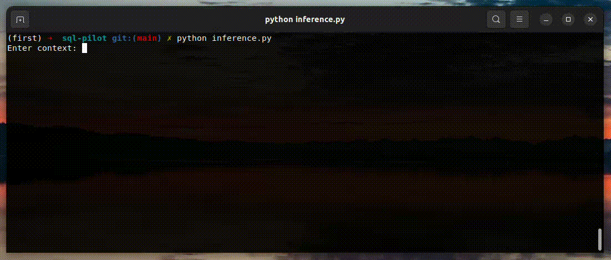

# SQL-PILOT
A small llama finetuned to create your SQL queries.
fast serving on cpu karpathy/llama.c




### Dataset
b-mc2/sql-create-context:  
```https://huggingface.co/datasets/b-mc2/sql-create-context/tree/main```


### Train sentencepiece on dataset.

- This will save a sentencepiece model in the cache directory.

    ```python scripts/train_tokenizer.py --vocab_size=<vocab size> --data_cache_dir=<your fav dir>\```  
    
- A limited functionality Tokenizer class is used to wrap this sentencepiece model. This trained checkpoint can be loaded into the Tokenizer class like this.
    ```
    from tokenizer import Tokenizer
    tokenizer = Tokenizer('data/tok3072.model')
    ```  

** This Tokenizer class and training code is adapted from karpathy/llama.c

### Padding details and Dataset Preparation:
- Sequences in a batch are left padded.
- In the below example the context and question string are concatenated to form the context string.
```
    A data sample:
    {
        "context": "some context",
        "question": "some question",
        "answer": "some answer"
    }
        
    <bos>: begin sequence token
    <eos>: end sequence token
    <pad>: pad token
    -100: label ignored by pytorch's CrossEntropyLoss by default

    encoded context tokens: [C1, C2, C3, C4, C5]
    encoded answer tokens:  [A1, A2, A3]

    input sequence  :[<bos>,   C1,   C2,   C3,   C4, C5, A1, A2,    A3,  <eos>]
    target sequence :[ -100, -100, -100, -100, -100, A1, A2, A3, <eos>,   -100]

```
- This will save a preprocessed dataset in the cache directory.  
    ```python scripts/prepare_dataset.py --tokenizer_path=<your fav dir> --data_cache_dir=<your fav dir>```


### Finetune
use finetune.py

